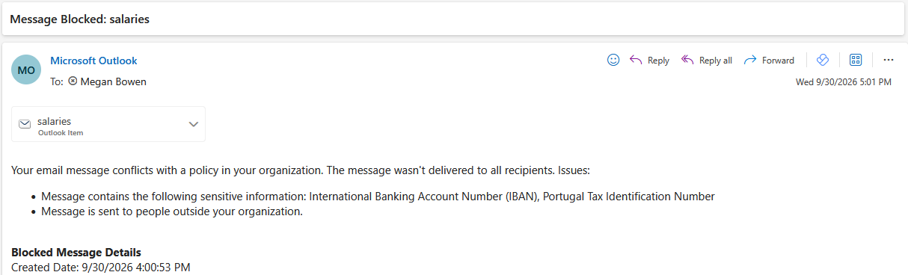
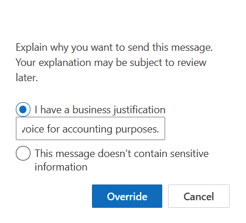
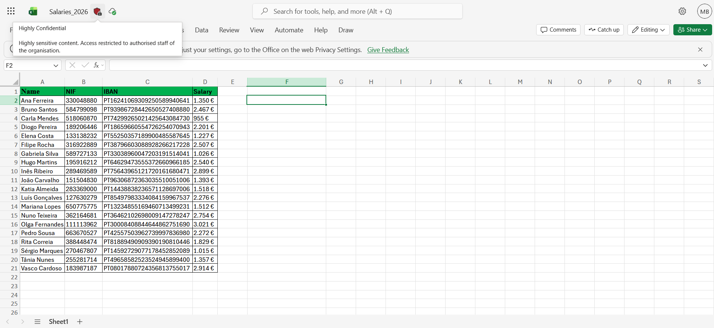

# Microsoft Purview Data Protection Lab


Hands-on lab covering data classification, sensitivity labels, DLP, retention and incident investigation in Microsoft Purview.

I configured each control, then tested it against fictitious data to confirm it actually worked. Every test has an expected result and the result I got — including what failed the first time and how I fixed it, because that is where I learned the most.

## Summary

I ran 7 tests against the controls. All 7 passed.

The main takeaway: the controls behaved as designed once propagation delays were over. Two of them — the audit log and the auto-labeling policy — only worked after I went around the portal with PowerShell. Service-side auto-labeling applied the label and encryption but not the visual watermark; content markings appear to be applied by Office apps when the labeled file is opened there.







## Contents

1. [Environment and prerequisites](#environment-and-prerequisites)
2. [How the pieces fit together](#how-the-pieces-fit-together)
3. [Test data](#test-data)
4. [What I configured](#what-i-configured)
5. [Test results](#test-results)
6. [Problems I ran into](#problems-i-ran-into)
7. [What I learned](#what-i-learned)
8. [Limitations](#limitations)
9. [GDPR and ISO 27001 mapping](#gdpr-and-iso-27001-mapping)
10. [Reproducing this lab](#reproducing-this-lab)
11. [Repository structure](#repository-structure)
12. [Notes](#notes)

## Environment and prerequisites

**Environment**

- Microsoft 365 E5 trial tenant, created by me for this lab
- Configuration done with the tenant admin account, signed in with the Global Administrator role
- One standard test user, Megan Bowen, created manually and used only for the end-user tests. No roles assigned to her; all admin work was done from the separate admin account
- Workloads: Exchange Online, SharePoint Online (site "Human Resources") and OneDrive
- Portal: purview.microsoft.com
- Work done between September and October 2026

**Prerequisites**

- Microsoft 365 E5 trial (or E5 Compliance / Purview add-on) — E3 alone is not enough for auto-labeling and some DLP actions
- Roles: Global Administrator (or Compliance Administrator + Purview roles)
- Audit log enabled in the tenant
- For the PowerShell workarounds: Exchange Online PowerShell module

## How the pieces fit together

```
Sensitive info types (SITs)   ->  detect what data is in a file or email
            |
Sensitivity labels            ->  classify it and protect it (marking, encryption)
            |
DLP policies                  ->  stop it leaving the organisation in the wrong way
            |
Retention                     ->  keep it for a defined period
            |
Alerts, Activity explorer,    ->  investigate and prove the controls worked
Audit log
```

I did it in this order because each layer needs the one before it. A label does not know when to apply itself, and a DLP rule needs to know what counts as sensitive. Testing the SITs first also showed me how confidence levels behave, which mattered later when I chose the confidence level for the auto-labeling and DLP rules.

## Test data

All data is fictitious. Purview checks the structure of what it detects (NIF check digit, IBAN mod 97, Luhn for cards), so random numbers are not detected. The values were generated with valid check digits, and the NIF (mod 11) and IBAN (mod 97) check digits were verified before use. When I ran the NIF SIT test on `Salaries_2026.xlsx`, Purview found 20 unique matches, which confirms the values pass validation.

| File | Content | Location | Why it is there |
|---|---|---|---|
| `Salaries_2026.xlsx` | 20 fictitious employees with NIF, IBAN and salary | Megan's OneDrive | High volume case |
| `Client_Invoices.xlsx` | 1 NIF and 1 IBAN | Megan's OneDrive | Low volume case |
| `Employment_contract_21.docx` | Names, address, Citizen Card number, 1 NIF | SharePoint site "Human Resources" | Document with identity data |
| `Cafeteria_Menu.docx` | Normal text, nothing sensitive | Megan's OneDrive | Negative control. Not matched by the auto-labeling simulation, and not flagged by DLP |
| `Internal_References.docx` | 9-digit numbers that fail the NIF check digit | Megan's OneDrive | False positive test |

## What I configured

### 1. Sensitive info types

I tested the built-in Portugal Tax Identification Number SIT against `Salaries_2026.xlsx`. The first tier in the results (**Low** confidence) lists 20 unique matches, because the number pattern alone is enough for Low. Only some values had the supporting keyword "NIF" nearby (the table showed "NIF" for some and "None" for others). This showed me that confidence depends on the context around the number, not only on the number itself.

I also created a custom SIT called **Internal Project Code**:

| Setting | Value |
|---|---|
| Pattern | `PROJ-20[0-9]{2}-[0-9]{4}` |
| Supporting keywords | `project`, `confidential` (case insensitive, word match) |
| Proximity | 300 characters |
| Confidence | High |

The format is made up by me, so there was no source to copy it from. I wrote the regex from the format I defined (prefix, year 2000-2099, 4-digit sequence) and tested it with positive and negative cases.

The Credit Card SIT was included in the auto-labeling rule, but none of my test files contain card numbers, so I did not exercise it.

### 2. Sensitivity labels

| Label | What it does |
|---|---|
| Public | No protection |
| Internal Use | Footer "Internal Confidential" |
| Highly Confidential | Encryption limited to users in the organisation, plus a red diagonal watermark "CONFIDENTIAL" |

Label policy (published to all users):

- Internal Use is the default label for documents, emails and meetings
- Users must give a justification to remove a label or lower its classification

Purview also created a default label called "Personal". I did not publish it.

Before creating the labels I had to turn on processing of encrypted labels for Office web files in SharePoint and OneDrive (a banner on the Sensitivity labels page). Without it, labeled and encrypted files cannot be handled properly in the web apps.

**Auto-labeling.** The policy applies Highly Confidential to files in SharePoint and OneDrive that contain a NIF, an IBAN or a credit card number. The simulation did not complete in the portal, so I enabled the policy via PowerShell. The review tab of the simulation did list three files: `Salaries_2026.xlsx`, `Client_Invoices.xlsx` and `Employment_contract_21.docx` (only the NIF was detected in the contract). The "Overwrite existing labels" option stays off so manual labels are not replaced. Neither `Cafeteria_Menu.docx` nor `Internal_References.docx` appeared in the results.

**Finding on the watermark.** Service-side auto-labeling applied the label and encryption but not the visual watermark. Content markings appear to be applied by Office apps when the labeled file is opened there. I observed this in the labeled files opened in Excel web and Word web; I did not test the manual remove-and-reapply path.

### 3. DLP

One policy, **Protect financial and identity data**, covering Exchange, SharePoint and OneDrive. It has three rules:

| Rule | Condition | Action | Override | Alert severity |
|---|---|---|---|---|
| High volume - block | NIF or IBAN, 5+ instances, AND content shared outside the organisation | Block external users, notify user, alert admin | No | High |
| Low volume - warn | NIF or IBAN, 1-4 instances, AND content shared outside the organisation | Policy tip, notify user, alert admin | Yes, business justification required | Low |
| Internal project code - warn | Internal Project Code SIT, AND content shared outside the organisation | Policy tip, restrict external users, alert admin | Yes, business justification required | Low |

**Why Low-confidence SIT matches triggered higher-confidence rules.** In the SIT test, matches are listed under every confidence tier they qualify for, so a value with the keyword "NIF" nearby appears under Low *and* under the higher tiers — which is why rules set to a higher confidence still fired.

Things worth knowing:

- Purview refuses the "block only people outside the organisation" action unless the rule has "content is shared with people outside the organisation" joined with AND. I hit this error while creating the rule.
- Alert severity is a setting on each rule. It is not calculated from the volume of data, so I set High on the blocking rule myself.
- I created the policy in simulation mode, checked the alerts, and only then turned it on.

### 4. Retention

Two layers:

| Layer | Type | Scope | Period |
|---|---|---|---|
| Selective | Retention label "Retain Financial Records", auto-applied by SIT | Exchange, SharePoint, OneDrive | 5 years, then review before deletion |
| General | Retention policy for Exchange | All mailbox content | 1 year, then delete automatically |

The label is not marked as a record or as regulatory. When both apply to the same item I rely on Purview's retention principles (retention wins over deletion, longest retention period applies), so the 5-year period should win. I did not test this conflict.

The auto-apply policy for the label is active. Auto-applied retention labels can take up to seven days to appear; item-level results are pending.

### 5. Monitoring and investigation

I cross-checked the same incident across several sources:

- **DLP alerts** — detail of the alert (user, recipient, SIT, rule, actions taken)
- **Activity explorer** — label applied and DLP rule matched events
- **Audit log** — confirmation of the `AlertEntityGenerated` event for the same incident
- **Labeled files opened in Excel and Word on the web** — confirmation that the labels were applied

## Test results

| ID | Test | Expected | Result |
|---|---|---|---|
| T1 | Email `Salaries_2026.xlsx` (20 records) from Megan to an external Gmail address | Policy tip, message blocked, alert | **Pass.** Message not delivered (NDR listing IBAN and NIF), High alert |
| T2 | Email `Client_Invoices.xlsx` (1 NIF, 1 IBAN) externally | Warning, user may continue | **Pass.** Policy tip with override offered |
| T3 | Override the warning with a business justification | Email is sent, decision logged | **Pass.** Justification prompt shown, email sent, confirmation tip displayed |
| T4 | Lower a label from Highly Confidential to Internal Use | Justification required, event logged | **Pass.** Justification required and event logged in Activity explorer |
| T5 | Check auto-labeling applied the label | Highly Confidential on the files | **Pass.** Label visible on `Salaries_2026.xlsx` (Excel web) and `Employment_contract_21.docx` (Word web). Service-side auto-labeling applied the label and encryption but not the visual watermark; content markings appear to be applied by Office apps when the labeled file is opened there. Observed in Excel web and Word web |
| T6 | Email `Internal_References.docx` (invalid 9-digit numbers) externally | No policy tip, no alert | **Pass.** Delivered normally, no alerts for that day. Default label footer "Internal Confidential" was applied |
| T7 | Email with `PROJ-2026-1234` and keywords | Detected by custom SIT, warning with override | **Pass.** Policy tip with override shown, justification entered, email sent |

**Count: 7 tests, 7 passed.**

Extra evidence: Activity explorer also shows the High volume rule matching on OneDrive items for `Salaries_2026.xlsx`.

## Problems I ran into

| Problem | Cause | What I did |
|---|---|---|
| Auto-labeling policy would not save: `UnifiedAuditLogDisabledException` | Audit log was off in the tenant. The portal button did not keep the setting | Used Exchange Online PowerShell. `Set-AdminAuditLogConfig` failed because the organisation had never been customised, so I ran `Enable-OrganizationCustomization` and then enabled auditing. Audit search worked afterwards |
| Regex rejected when creating the custom SIT | Word match mode needs a prefix, one capturing group and a suffix | Used string match with the plain regex |
| "Block external" action rejected | The rule lacked the "shared outside the organisation" condition | Added it with AND on all rules |
| First DLP tests produced alerts under OneDrive, not Exchange | I had used the OneDrive Share button instead of attaching the file to an email | Repeated the tests in Outlook web with a real attachment |
| Alerts took a long time to appear | Normal propagation delay | Waited and refreshed |
| Auto-labeling simulation stuck on "in progress" for days; "Turn on policy" greyed out | Unclear. PowerShell showed the test mode as not completed with 0 expected locations | Enabled the policy from PowerShell with `Set-AutoSensitivityLabelPolicy -Mode Enable`. Labels were applied afterwards |
| Agent summary tab on alerts: "You don't have access" | Missing role for the agent feature | Skipped it. The Overview and Events views had what I needed |

## What I learned

- **Detection depends on valid data and on context.** Random numbers are not detected, and a keyword near the number raises the confidence tier.
- **Simulation mode is worth the wait.** It showed me what the auto-labeling and DLP policies would match before anything was enforced.
- **The portal can show a stale state.** The auto-labeling policy looked stuck in the UI, and PowerShell showed what was really happening.
- **Where you test changes the result.** Sharing from OneDrive and attaching a file in Outlook produce alerts in different locations.
- **Propagation delays are real.** Several times I thought a control was broken and it worked after waiting.
- **Service-side auto-labeling does not apply the visual watermark.** The label and encryption are applied by the service, but content markings appear to be applied by Office apps when the labeled file is opened there.

## Limitations

- Everything ran in one trial tenant with one test user and one external recipient (a personal Gmail address)
- DLP cannot stop someone photographing the screen or copying values by hand
- Endpoint DLP and Teams DLP are not configured
- Credit card numbers and the Portugal Citizen Card SIT were not tested
- Retention auto-apply item-level results are still pending
- The watermark behaviour was observed in Excel and Word web only; I did not test the manual remove-and-reapply path or the desktop apps
- Thresholds (5+ records) are my own choice for the lab, not a recommendation for a real organisation

## GDPR and ISO 27001 mapping

This is a study exercise. Article and control numbers should be checked against the official texts before anyone relies on them.

| Control in the lab | GDPR | ISO/IEC 27001:2022 Annex A |
|---|---|---|
| SITs and classification | Art. 5(1)(f), Art. 32 | A.5.12 Classification of information |
| Sensitivity labels and encryption | Art. 25, Art. 32 | A.5.13 Labelling of information, A.8.24 Use of cryptography |
| DLP on email and cloud | Art. 32 | A.5.14 Information transfer, A.8.12 Data leakage prevention |
| Retention | Art. 5(1)(e) | A.5.33 Protection of records |
| Alerts and audit log | Art. 5(2) | A.8.15 Logging |

I did not map Art. 33 (notification of a personal data breach) because the lab does not cover breach assessment or notification; the alerts and audit log would only provide the evidence that a breach happened.

## Reproducing this lab

1. Create an M365 E5 trial tenant and one standard user.
2. Enable auditing (see [Problems I ran into](#problems-i-ran-into) — you may need `Enable-OrganizationCustomization` first).
3. Create the sensitivity labels and publish the label policy.
4. Create the custom SIT and test it against positive and negative samples.
5. Create the auto-labeling policy and run it in simulation mode first.
6. Create the DLP policy in simulation mode, then enable it.
7. Create the retention label + auto-apply policy and the mailbox retention policy.
8. Run each test from the [Test results](#test-results) table and capture the evidence.

Expect propagation delays at every step. If something looks broken, wait and refresh before assuming it is.

## Repository structure

```
purview-data-protection-lab/
├── README.md
├── test-data/
│   ├── Salaries_2026.xlsx
│   ├── Client_Invoices.xlsx
│   ├── Employment_contract_21.docx
│   ├── Cafeteria_Menu.docx
│   └── Internal_References.docx
└── screenshots/
    ├── 01-test-data/
    ├── 02-labels-and-sits/
    ├── 03-dlp-policies/
    ├── 04-retention/
    ├── 05-tests/
    └── 06-investigation/
```

## Notes

- All data is fictitious. No real personal or financial data was used.
- Screenshots have the tenant domain, email addresses covered.
- I used an AI assistant to help with troubleshooting and to review my write-up. I did the configuration and the testing, and the conclusions are mine.
